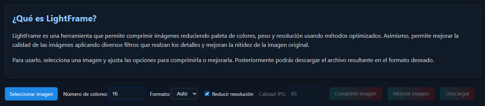
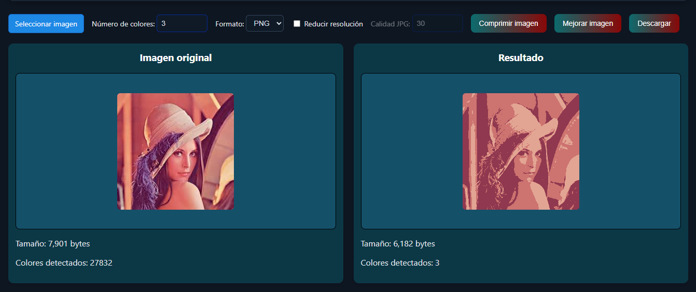
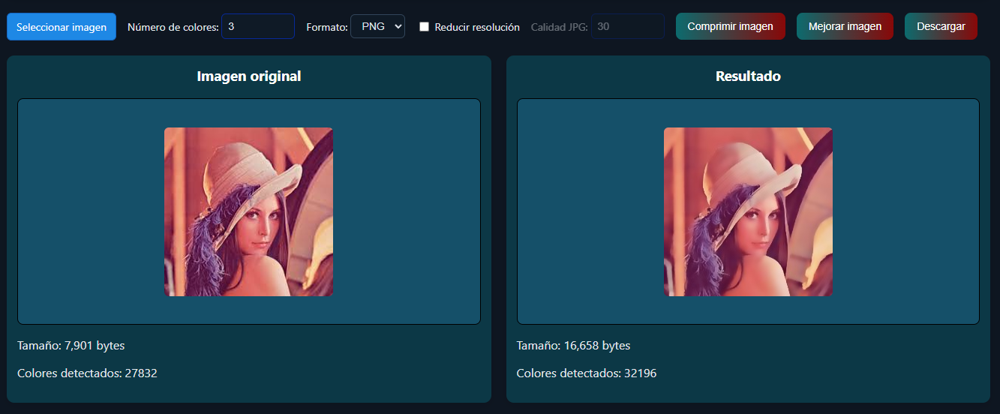

# 🖼️ LigthFrame

## 🌐 Acceso en línea
Puedes usar la aplicación directamente desde la web:  
👉 **(https://lightframe.onrender.com/)**  

---

## 🧩 Descripción general
LightFrame permite la compresión de imagenes reduciendo la paleta de colores de las mismas y una mejora de imagenes aplicando filtros que realzan los detalles y mejoran la calidad de las imagenes.
El usuario puede:
1. **Subir una imagen** desde su ordenador.  
2. **Seleccionar el número de colores** deseado.
3. **Seleccionar el tipo de archivo** para descargar.
4. **Comprimir o mejorar** una imagen.

---

### 🔸 Interfaz principal
  
1. **Seleccionar imagen:** elige una imagen desde tu ordenador.  
2. **Número de colores:** ajusta cuántos colores deseas conservar.  
3. **Comprimir o mejorar imagen:** aplica el algoritmo pillow adaptative para reducir la paleta y Bicubic interpolation para
la mejora de la imagen.  
4. **Descargar:** guarda la versión comprimida. 

---

### 🔸 Ejemplo de compresión
  
A la izquierda se muestra la imagen original con su tamaño;  
a la derecha, la versión comprimida con menos colores y menor tamaño en bytes.

---

### 🔸 Ejemplo de mejora
  
A la izquierda se muestra la imagen original con su tamaño;  
a la derecha, la versión mejorada con colores más vibrantes y
bordes suavizados.

---

## ⚙️ Tecnologías utilizadas
- **Frontend:** React + Vite + CSS  
- **Backend:** FastAPI (Python)  
- **Despliegue:** Render (Web Service + Static Site)  

---

## 💡 NOTA ADICIONAL

El sistema funciona correctamente en Render, pero debido a las limitaciones del plan gratuito, el servidor puede entrar en modo suspensión o producir errores de conexión con imágenes grandes (>1 MB). Se recomienda usar imágenes pequeñas o medianas para obtener los mejores resultados.